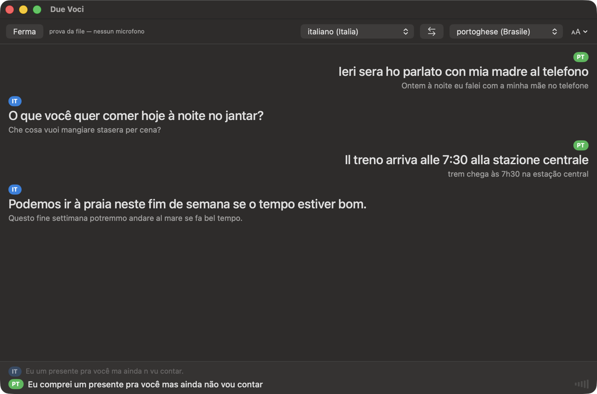
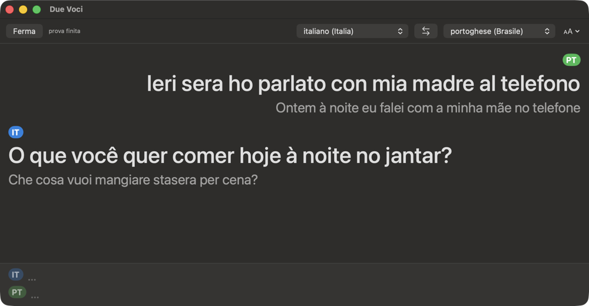

# Due Voci · Live Translate

Sottotitoli tradotti, in locale, per una conversazione fra due persone che
parlano lingue diverse allo stesso tavolo e nello stesso microfono.

<p align="center"></p>

Qui dentro ci sono **due tentativi** della stessa idea. Il primo,
`live-translate`, e' fermo: la misura che lo ha fermato sta [piu' sotto](#perche-il-primo-tentativo-e-fermo)
ed e' la parte piu' utile del repo. Il secondo, **Due Voci**, e' quello che
funziona, ed e' quello da cui partire.

---

## Due Voci

```bash
native/build.sh          # compila l'app e il banco di misura
open native/DueVoci.app  # premi Ascolta, o barra spaziatrice
```

macOS 26 o superiore, Apple Silicon. Nessuna dipendenza da installare: i
modelli sono quelli del sistema.

**L'idea, in una riga.** Le app che fanno questo traducono in UNA direzione,
perche' il caso normale e' "guardo un video straniero"; due persone che si
alternano sono un caso diverso, e chi lo risolve lo fa mandando l'audio in
cloud a pagamento. Qui girano **due trascrittori sullo stesso microfono**, uno
per lingua, e chi ha parlato si decide confrontando quello che hanno capito.

Il trucco e' che il trascrittore sbagliato non produce parole sbagliate:
produce **frammenti**. Dove quello portoghese sente `Ontem à noite eu falei com
a minha mãe no telefone`, quello italiano sente `a noi con`. Quindi vince chi
ha trascritto piu' parole che il correttore ortografico di sistema riconosce
come proprie; a parita', chi ne ha di piu' esclusive della sua lingua. Il
router sta in `native/Router.swift`, compilato **sia dall'app sia dal banco di
misura**: il banco non ne ha una copia, o misurerebbe la copia.

Mentre si parla, **entrambi i trascrittori sono a schermo**: quello che sta
vincendo e' acceso, l'altro spento accanto ai suoi frammenti. Si vede chi sta
parlando mentre parla, senza aspettare la frase finita — e quando il testo non
arriva ancora, il VU meter dice se il microfono sente. Poi la battuta si fissa
con la traduzione sopra e l'originale sotto, a sinistra o a destra secondo chi
ha parlato. Un `?` arancione segna le righe in cui la lingua e' stata decisa
per un soffio, invece di far finta di essere sicuri.

### Le due manopole

**Lingue.** Qualunque coppia fra le **25 utilizzabili** su macOS 26 — italiano,
portoghese, spagnolo, francese, tedesco, inglese, coreano e le loro varianti
regionali. Il menu marca con `↓` le lingue il cui modello non e' ancora sul
Mac: sceglierle costa un download, una volta sola. Cambiare lingua rifa' i
trascrittori a caldo, non serve riavviare.

Che non sia solo interfaccia e' misurato sul banco con una coppia diversa da
quella di sviluppo: `--lingue it-IT,en-US` su quattro frasi, **4/4**, primo
testo a 822 ms. Poche frasi, ma bastano a dire che il router non e' cablato
sull'italiano e sul portoghese.

Le lingue offerte sono meno di quelle che macOS sa trascrivere, e il filtro non
e' l'ASR: e' il **correttore ortografico**, che qui non fa da correttore ma da
giudice. Restano fuori giapponese e cinese, che il trascrittore conosce e il
correttore no. Il motivo per cui questo filtro esiste invece di lasciar
scegliere tutto e' il primo dei tranelli qui sotto.

**Dimensione del testo.** Quattro passi, dal menu `Aa` o con ⌘+ / ⌘−; l'ultimo
serve a usarla come sottotitolo da lontano. La scelta resta fra un'apertura e
l'altra, insieme alle lingue.

<p align="center"></p>

### Quanto e' veloce, misurato

24 frasi, 12 italiane e 12 portoghesi, di quelle che si dicono davvero a cena
(«Va bene dai», «Espera um pouquinho», «Ti ho comprato un regalo ma non te lo
dico ancora»). Stesso binario, stessi file, due modi:

| | prima (solo finali) | dopo (volatili + rapidi) |
|---|---|---|
| primo testo mentre parli | **mai** | **~750 ms** |
| testo definitivo dopo che hai smesso | 6887 ms | **~3800 ms** |
| riga pubblicata dopo che hai smesso | 7284 ms | **~3850 ms** |
| lingua indovinata | 21/24 | 20-21/24 |

L'ultima riga e' quella che conta piu' delle altre, e dice il contrario di
quello che una versione precedente di questo file annunciava. C'era scritto
«lingua indovinata da 4/6 a 6/6», attribuito a `.fastResults`: era **una
passata fortunata su sei frasi**. Le stesse sei, rilanciate tre volte, hanno
dato 5/6, 6/6 e 4/6 — e la manopola con cui credevo di averle stabilizzate era
[scollegata](#i-sei-modi-in-cui-una-misura-di-latenza-puo-mentire). Su
ventiquattro frasi i risultati rapidi **non migliorano il riconoscimento della
lingua**: lo lasciano dov'era. Fanno arrivare il testo prima, che era il punto;
non lo fanno arrivare piu' giusto.

Ventiquattro frasi restano poche: fra 20/24 e 21/24 non c'e' differenza che
significhi qualcosa, ed e' esattamente per questo che qui sopra c'e' scritto
«lo lasciano dov'era» invece di «peggiora leggermente». Un campione che non sa
distinguere due numeri non ha il diritto di ordinarli.

Le tre-quattro righe che cadono sono sempre la stessa cosa, e adesso si legge:
frasi **corte**, dove i due trascrittori producono testi che valgono uguale.
`«E spera un pochino.»` contro `«Espera um pouquinho»` fa due parole valide per
parte, e a quel punto decide un criterio di spareggio che su un pareggio pieno
tiene la prima lingua. Non lo tocco apposta: ho ventiquattro frasi, e tarare lo
spareggio su di loro sarebbe la circolarita' con cui questo progetto si e'
aperto, alla terza occorrenza.

La leva della velocita' e' **una sola opzione**: `.fastResults` accanto a
`.volatileResults`. `volatileResults` da solo **non basta** — senza il compagno
il primo testo non arriva mai mentre parli. Sta scritto qui perche' non e'
deducibile dall'API: si vede solo aprendo
`SpeechTranscriber.Preset.progressiveTranscription` e guardando cosa contiene.

Il resto della latenza e' politica di chiusura. I due trascrittori non
finalizzano insieme: misurato, da 30 ms a 2 secondi di scarto. Aspettare sempre
il secondo costerebbe quei 2 secondi a ogni frase; non aspettarlo mai vorrebbe
dire decidere con meta' delle prove. Quindi si guarda chi guidava **sui
provvisori**: se a chiudere e' lui, la prova c'e' gia' e si pubblica subito; se
e' l'altro, si concedono 1,2 s. Chi non ha ancora chiuso viene giudicato
sull'ultimo provvisorio, che e' cio' che ha capito anche se non l'ha ancora
dichiarato.

### Cosa non e' misurato

Il 21/24 e' su **voci sintetiche, audio pulito**, senza rumore e senza voci
sovrapposte. Il parlato vero e' peggio, e quel numero va rifatto li'. E la
latenza e' misurata dal banco, che alimenta i trascrittori da file: il
microfono vero aggiunge la sua, non misurata.

### Vederla funzionare senza parlare

```bash
open -n --env DV_PROVA=/percorso/frase1.wav:/percorso/frase2.wav native/DueVoci.app
```

Da' in pasto i file invece del microfono, alla velocita' con cui sarebbero
stati pronunciati, e parte da solo. In questo modo il microfono non si accende
affatto. Serve a controllare che l'app funzioni prima di sedersi a tavola con
qualcuno — e a fotografare la striscia in diretta senza far uscire un suono.

Le due immagini qui sopra vengono da li'.

---

## Quattro tranelli, pagati

Nessuno dei quattro dava un errore. Tre facevano sembrare l'app o la misura
_a posto_, che e' la ragione per cui stanno scritti.

**1. Un codice di lingua che il correttore non conosce non fallisce: dice si' a
tutto.** La stessa frase italiana da' 7 parole valide chiesta in `it`, e 7
chieste in `ja` o in `zz`. Un router costruito su un giudice cosi' non sbaglia
— smette proprio di decidere, e nessuno se ne accorge, perche' i due testi
valgono sempre uguale e vince chi ne ha scritte di piu'. E' il motivo per cui
il menu delle lingue e' un catalogo filtrato (`Catalogo.costruisci`) e non
l'elenco di quello che l'ASR sa trascrivere.

**2. `downloadAndInstall()` chiamato dal thread principale non torna mai.**
L'app resta ferma su quella riga per sempre. Lo stesso identico codice in un
binario da terminale, che non e' isolato sul main, dura 0,2 s. Non e' lentezza,
e' un blocco: in `DueVoci.swift` la chiamata e' `nonisolated` apposta.

**3. `engine.inputNode` fa un `dispatch_sync` interno, e si impianta se il
thread principale e' fermo dentro una catena async.** Finche' l'unico modo di
accendere il microfono era premere un pulsante, non succedeva mai. Con il menu
delle lingue succede al primo cambio, perche' il riavvio parte da un
aggiornamento di vista: app congelata su «controllo i modelli», stack in
`__DISPATCH_WAIT_FOR_QUEUE__`. Il microfono ora si accende in una funzione
`nonisolated`, fuori dal main, e in prova da file non si accende affatto —
accenderlo per spegnerlo subito era pagare un deadlock per un'apparecchiatura
che non serviva.

**4. Il banco non poteva vedere le righe doppie, per costruzione.** Il
trascrittore perdente chiude fino a 2 secondi dopo che la riga e' stata gia'
pubblicata, e quel definitivo in ritardo apriva una riga NUOVA con quello che
il perdente aveva capito: due righe per una frase sola, la seconda spazzatura
nella lingua sbagliata. Il banco taglia la frase fra un file e l'altro e azzera
la contabilita', quindi quel caso non lo attraversa mai. Si e' visto in una
schermata dell'app piena: cinque frasi in ingresso, **sette righe a schermo**.
Dopo la correzione (`attesiInRitardo`), cinque frasi → cinque righe, `PT IT PT
IT PT`.

E i risultati vanno consumati con `for try await`: l'errore dello stream, se lo
si ingoia con un `catch {}` vuoto, fa sembrare "silenzioso" un motore che sta
invece fallendo.

---

## Il banco di misura

`native/bench` rimpiazza il microfono con file audio riprodotti a velocita'
reale: se la frase dura 3,4 secondi, il banco impiega 3,4 secondi a darla in
pasto, un pezzetto da 100 ms alla volta come farebbe il tap dell'AVAudioEngine.

```bash
native/bench --veloce frasi/*.wav              # come e' adesso
native/bench frasi/*.wav                       # come era prima
native/bench --veloce --lingue es-ES,fr-FR …   # un'altra coppia
```

La lingua attesa di ogni file si legge dal nome: `it03.wav` deve dare la prima
lingua, `pt01.wav` la seconda. E una riga rossa dice **cosa ha visto**, non
solo che ha sbagliato: sotto ogni `NO` il banco stampa i due testi e se
venivano da un definitivo o da un provvisorio. Senza, si tira a indovinare su
un correttore ortografico che e' una scatola nera.

### I sei modi in cui una misura di latenza puo' mentire

Sei cose sono state necessarie perche' il banco misurasse qualcosa invece di
tacere o di mentire, e nessuna era prevedibile.

Le prime tre lo facevano **tacere**:

- la cadenza va tenuta su una **scadenza assoluta**: con `sleep(100ms)` in un
  ciclo che fa anche altro si arriva a dare 3,5 s di audio in 5,4 s, e i tempi
  misurati diventano i tempi del banco;
- il silenzio fra le frasi dev'essere **fruscio, non zero digitale**: un
  microfono vero non produce mai zeri;
- i modelli vanno chiesti con `AssetInventory` **anche quando il sistema li
  elenca gia' come installati**: senza, i trascrittori partono, non danno
  errore, e non producono niente.

Le altre tre lo facevano **mentire**, ed erano peggio, perche' un banco che
tace lo vedi:

- `--attesa` stampava un valore che **non applicava**: la politica di chiusura
  aveva `1200` cablato in due posti, l'app e il banco, mentre il banco
  annunciava `700`. Tre passate con manopole diverse davano numeri diversi, e i
  numeri erano solo la varianza del caso — la manopola non era collegata a
  niente. Ora la costante sta in `Politica.attesaAltroMs` dentro `Router.swift`,
  che compilano entrambi;
- le frasi **colavano da un file all'altro**: `azzera()` ripuliva la
  contabilita' del banco, non i trascrittori, che tirano avanti con la loro
  segmentazione. Una riga sbagliata conteneva tre frasi di tre file diversi
  (`«E spera un poqui. Esto morta de cansasso. E bom.»`) e le sbagliava tutte
  per colpa delle altre due. Serve tagliare la frase con `finalize(through:)`
  su entrambi;
- ma `finalize(through:)` **non torna mai** se non arriva altro audio:
  aspettarlo impiantava il banco al sesto file su ventiquattro, a CPU zero,
  dopo cinque andati lisci. Si lancia senza aspettarlo e gli si da' mezzo
  secondo di fruscio, che e' l'input con cui raggiunge il confine.

---

## Perche' il primo tentativo e' fermo

`live-translate` faceva la stessa cosa con `whisper.cpp`. E' fermo, e vale la
pena dire perche' invece di lasciarlo scadere in silenzio: il collo di
bottiglia non era il router delle lingue, che dopo tre misure era arrivato a
**0% di errore su 404 frasi** nel ramo che guarda il testo. Era whisper, un
livello piu' sotto.

In una conversazione vera di 21 minuti, **il 21% delle righe trascritte era
inglese**: `Thank you.`, `- Ready? - Try to look in there.`, roba che nessuno
aveva detto. Whisper stava trascrivendo il silenzio e il rumore della stanza. E
quelle righe il router le instrada come portoghese con piena confidenza, perche'
non ha un ramo "nessuna delle due" — vede parole non italiane e conclude. Il
campione di misura non poteva accorgersene **per costruzione**: teneva solo le
frasi che i giudici dicevano it o pt, quindi buttava via esattamente il modo in
cui il sistema falliva.

La cosa si misura in quattro file e due comandi. Stesso audio, due motori:

| audio | Apple `SpeechAnalyzer` | whisper large-v3-turbo `-l auto` |
|---|---|---|
| 180s di silenzio digitale | *niente* | `you you you you you I` |
| 120s di rumore di stanza (-65 dB) | *niente* | `Thank you.` ×4 |
| 120s di rumore forte (-40 dB) | *niente* | `Thank you.` ×4 |
| frase italiana + 25s di silenzio | la frase, esatta | la frase **+ `Grazie a tutti.`** |

Non e' una questione di soglie: e' architettura. Whisper e' un encoder-decoder
autoregressivo, *deve* emettere token, e sul silenzio pesca il testo piu'
probabile del suo addestramento — i ringraziamenti e i crediti dei sottotitoli
su cui e' stato addestrato. Un motore streaming non ha un decoder da alimentare
e sul silenzio non emette niente. Nessun `--vad`, nessun filtro a valle e
nessuna lista di frasi note porta il primo dove il secondo parte.

Nel passaggio si guadagna anche il peso. Misurato mentre trascrive in due
lingue: l'app sta in **37 MB** di footprint, e i servizi di riconoscimento del
sistema ne aggiungono 34 — **~70 MB in tutto**, perche' i modelli non stanno
nel processo, stanno fuori e girano sul Neural Engine. `live-translate` teneva
**~700 MB** residenti solo per whisper, e li teneva anche quando nessuno
parlava.

(Una versione precedente di questo file diceva 76 MB e il codice diceva 16: due
numeri diversi per la stessa cosa, nessuno dei due rimisurato. Questi sono
`phys_footprint`, la cifra su cui macOS decide la pressione di memoria.)

### Le tre lezioni che restano

1. **Una misura puo' essere circolare al 100% senza che si veda.** La prima
   versione selezionava le frasi italiane con le stesse parole che il detector
   usa per riconoscerle: «da 4,2% a 1,41% su 426 frasi vere» non valeva niente.
   Da li' i due giudici indipendenti di `build_goldset.py`.
2. **Un numero solo media rami che non si assomigliano.** Spaccato per ramo,
   `default` risultava sbagliato sull'italiano *sempre* — e faceva da solo tre
   quarti dell'errore. Le ultime tornate di tuning stavano limando il ramo che
   era gia' a zero.
3. **La prova e il difetto non devono condividere una costante.** Vale per il
   campione di misura e vale per il trascinamento della finestra: entrambi
   dicevano "ok" perche' si controllavano con lo stesso numero con cui erano
   stati scritti.

---

## Live Translate, il primo tentativo

Resta nel repo perche' e' dove sono state fatte le misure. Funziona ancora,
con il difetto documentato qui sopra.

```bash
./setup.sh                           # whisper.cpp, modello, traduttore locale
open LiveTranslate.app               # finestra nel Dock, con pin
./live-translate --bidi              # conversazione a due
./live-translate --src es --dst en   # altra coppia di lingue
./live-translate --tts               # legge le traduzioni ad alta voce
./live-translate --capture 3         # audio di sistema invece del microfono
```

macOS 13 o superiore. Il setup e' idempotente. Lingue diverse dalla coppia
predefinita: `LT_SETUP_SRC=es LT_SETUP_DST=en ./setup.sh`.

```
microfono → whisper.cpp (locale, Metal) → traduzione → finestra
                    ↓
              history/*.jsonl
```

**Trascrizione**: `whisper.cpp` in sliding window, encoder su Metal. L'audio
non esce mai dalla macchina. Il default e' `large-v3-turbo` quantizzato.

**Traduzione**, in ordine di preferenza: Argos Translate in locale → Cerebras
(se hai una chiave con credito) → Apple Translate on-device → MyMemory. Un
backend che risponde 401/402/429 viene escluso per sei ore invece di essere
ritentato a ogni frase, e lo stato sopravvive ai riavvii.

**Interfaccia**: un server HTTP su `127.0.0.1` e una finestra `WKWebView`
nativa. Dalla barra si cambiano a caldo lingue, modello e volume del microfono.
Ogni riga finisce in `history/<data>.jsonl` mentre appare a schermo, quindi
sopravvive a crash e riavvii.

| variabile | |
|---|---|
| `CEREBRAS_API_KEY` | opzionale, migliora la qualita' della traduzione |
| `LT_EMAIL` | alza la quota MyMemory da 1.000 a 10.000 parole al giorno |
| `LT_WHISPER` | percorso di `whisper-stream` se non e' nel PATH |
| `LT_PORT` | porta del server locale (default 8777) |

### Come si misurava il router

```bash
./verify.py                            # esce non-zero se qualcosa si rompe
./verify.py --drag                     # trascina la finestra con eventi veri
.venv/bin/python error_by_branch.py    # l'errore, spaccato per ramo
```

Il riconoscimento della lingua si misura su `goldset.json`, un campione di
frasi vere prese dalla cronologia dove **due** giudici esterni concordano:
langdetect e il correttore ortografico di macOS. Uno solo non basta: langdetect
chiama 'italiano' del portoghese nel 4% dei casi.

Quel file **non e' nel repo**, ed e' voluto: sono frasi di conversazioni
private, e un campione di misura non e' un motivo sufficiente per pubblicare
quello che si sono detti due persone a cena. Ognuno costruisce il suo dalla
propria cronologia, con `.venv/bin/python build_goldset.py`. Senza, gli
strumenti di misura lo dicono e si fermano invece di inventare un numero.

Un numero solo su quel campione pero' media rami che non si assomigliano:

| ramo | quota dell'italiano | errore | cosa e' |
|---|---|---|---|
| `parole` | 78,8% | **0%** (0/404) | guarda il testo |
| `whisper` | 17,9% | 3,3% (3/92) | si fida della lingua del chunk |
| `default` | 2,9% | **100%** (15/15) | non decide: tiene la direzione principale |

`default` non e' un ramo che sbaglia spesso, e' un ramo che sull'italiano
sbaglia **sempre**, per costruzione. Da solo fa i tre quarti dell'errore
italiano (2,92 punti su 3,90): quello che conta non e' la sua percentuale, e'
quanto parlato ci finisce dentro.

Due avvertenze che lo strumento stampa da solo. La **copertura**: `default` ha
un'etichetta su 16 righe (6%), quindi il suo numero e' una voce, non una
misura. E il fatto che rilanciare `route()` su un file di testo **non e'** il
router vivo: la lingua rilevata da whisper esiste solo mentre l'app ascolta.

### Il trascinamento: la prova col permesso

`./verify.py` prova che la finestra **si puo'** spostare, con `setFrameOrigin`.
Ma `setFrameOrigin` e' proprio la strada che `performDrag` non percorre: se il
trascinamento si rompesse dentro `performDrag`, quella riga resterebbe verde.

`./verify.py --drag` preme davvero sulla striscia con eventi di mouse veri e
guarda se la finestra segue. Postare eventi sintetici richiede, da Mojave, il
permesso di Accessibilita' — e quel permesso e' **per programma**, non per
utente. Da qui due strade:

| strada | chi deve essere autorizzato | quando si usa |
|---|---|---|
| binario diretto (default) | il **terminale** da cui lanci: il figlio eredita | sempre, gira senza toccare interruttori |
| app vera (`--drag --bundle`) | **LiveTranslate.app** | passata fedele quando tocchi il codice della finestra |

Il default non chiede niente a nessuno e **non si spegne a ogni
`./build-app.sh`** — la firma e' ad-hoc, cambia a ogni compilazione, e macOS
considera stantia l'autorizzazione data al bundle. Se la prima strada non e'
autorizzata si ripiega da sola sulla seconda, ma **solo su un saltato**: un
rotto e' una risposta, e riprovare altrove servirebbe solo a cercarne una piu'
comoda. Quando nessuna delle due e' autorizzata il test si dichiara `[salt]` e
non conta ne' come passato ne' come rotto.

I denti sono verificati al contrario, che e' l'unico modo di sapere che un test
possa fallire: togliendo `performDrag` da `mouseDown` e rimettendo la striscia
sulla costante vecchia, la riga diventa rossa con `dx=0 dy=0`; sul codice buono
torna `dx=90 dy=-45`. Attenzione a cosa **non** copre: `isMovable = false` e
`isMovableByWindowBackground = false` non la fanno arrossire, perche'
`performDrag` scavalca entrambi i flag.

Questa prova ha gia' pagato: alla prima esecuzione ha trovato la striscia di
trascinamento posizionata sulle misure iniziali della finestra (1020x480)
invece che su quelle vere ripristinate dall'autosave (1193x738). Restava a
mezz'aria in mezzo alla pagina, in alto non c'era niente da afferrare — e
l'autodiagnosi diceva "ok", perche' cercava la striscia alle stesse coordinate
con cui l'aveva messa: la prova e il difetto condividevano la costante.

### Limiti noti

- Latenza ~1-2s: whisper deve sentire abbastanza audio prima di trascrivere.
- Argos e' irregolare, da 0,7s a 5s sulla stessa frase.
- Il tier gratuito di MyMemory si esaurisce in una ventina di minuti.
- Apple Translate funziona solo se hai gia' scaricato le lingue da Impostazioni
  → Generali → Lingua e Zona → Lingue tradotte.
- Con audio molto rumoroso whisper allucina. Vedi sopra: e' il motivo per cui
  il progetto e' fermo.
- La misura della lingua vale sulla **trascrizione**, non sull'audio: se
  whisper impasta una frase italiana in qualcosa che sembra portoghese, i due
  giudici dicono portoghese e il router risulta "giusto" su una riga sbagliata.
  La cronologia non conserva l'audio, quindi questo si puo' dichiarare ma non
  misurare.

## Licenza

MIT.
